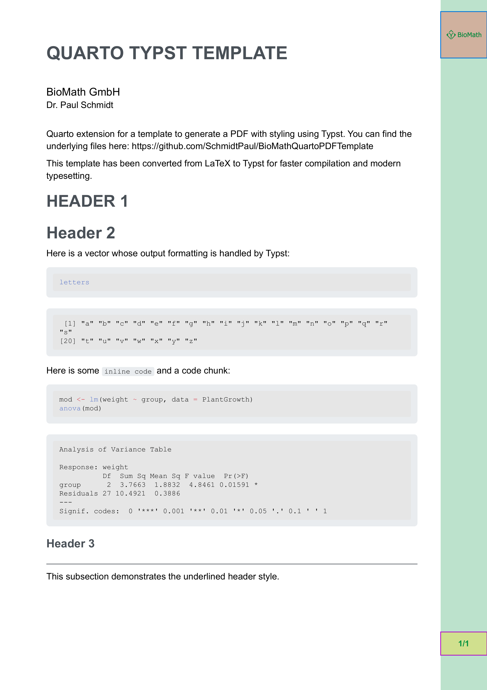

# BioMathQuartoPDFTemplate

A Quarto extension for creating professionally styled PDF documents for biological and mathematical content using **Typst**. This template provides a clean, modern design with customizable styling options and faster compilation than LaTeX-based templates.

## ✨ New in Version 2.0

- **Migrated to Typst** for faster compilation and modern typesetting
- Maintained all original design elements (colors, logo, layout)
- Improved code block formatting
- Preserved Ubuntu font styling

Here is an example of the template in action:



## Installation

### Option 1: Start a New Project with the Template

To create a new project with this template:

``` bash
quarto use template SchmidtPaul/BioMathQuartoPDFTemplate
```

### Option 2: Add to an Existing Project

To use this extension in an existing project:

``` bash
quarto install extension SchmidtPaul/BioMathQuartoPDFTemplate
```

Then, add this to your document's YAML:

``` yaml
format: BioMathQuartoPDFTemplate-typst
```

## Usage

After installation, create a new .qmd file with this YAML header:

``` yaml
---
title: "Your Document Title"
subtitle: "Document Subtitle"
author: "Your Name"
format: BioMathQuartoPDFTemplate-typst
---
```

## Requirements

- Quarto with Typst support (Quarto >= 1.4)
- Ubuntu font (falls back to Arial if unavailable)

## Design Features

- Professional BioMath branding with logo
- Custom green color scheme
- Right-side colored margin with logo and page numbers
- Styled headers and code blocks
- Modern Typst-based typesetting
